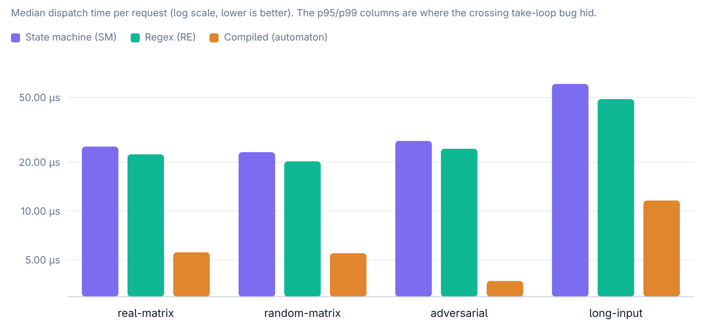

# pathfinder

**Lean, mean, pathfinding state machine.**

A lean HTTP framework for Deno — fetch-native, routes that live in the
filesystem, and a compiled radix automaton underneath. Where Oak and Hono
give you route tables, pathfinder gives you a routing tree you can patch in
production with a mounted directory.

## Routes are files

Every character of the `#` pattern grammar is legal in file and directory
names on every OS (unlike `:name`, `*rest`, or `[x]`), so the filesystem
*is* the route table: **the directory path is the pattern, the `<method>.ts`
file is the handler.**

```
endpoints/
  ping/get.ts                    → GET    /ping
  api/v1/rooms/#roomId/get.ts    → GET    /api/v1/rooms/:roomId
  items/#(int)id/get.ts          → GET    /items/:id        (bigint — no truncation)
  prices/#(num)n/get.ts          → GET    /prices/:n        (number)
  files/#name.json/get.ts        → GET    /files/:name.json (multi-char anchor)
  build/#version#osx/get.ts      → GET    /build/:version + "osx" (stop signal)
  mirror/#src/into/#src/get.ts   → GET    equality: both captures must match byte-for-byte
  static/#...path/get.ts         → GET    /static/*  (greedy rest — also the SPA/catch-all recipe)
```

No `index.ts` lies, no reserved segments — directories are 100% URL
namespace. Middleware lives beside the routes it wraps
(`api/10-auth.ts`), outcome pages are digit files (`404.ts`, `500.ts`), and
`.d.ts` files are ignored (they're the generated types: `deno task gen`).

Handlers get `(request, context)` and return domain values:

```ts
// endpoints/api/v1/rooms/#roomId/get.ts
export const auth = false; // named exports = route meta → context.meta

export default async (request, context) => {
  const timeline = await context.app.rooms.timeline(request.params.roomId);
  return timeline; // object → JSON; string → text/plain; Response → untouched
};
```

Throw `new HttpError(404, "…")` for errors; return a `Response` for full
control; stream `ReadableStream`s — bodies are streams, nothing buffers
unless you ask.

## Hackability is the point

`PATHFINDER_USER_ENDPOINTS` points at additional endpoint roots. Routes
found there **override or augment the app's own — no changes to the app's
code required.**

```sh
docker run \
  -v ./my-fixes:/patches \
  -e PATHFINDER_USER_ENDPOINTS=/patches \
  some-app-built-on-pathfinder
# ./my-fixes/api/v1/rooms/#roomId/get.ts now shadows the built-in route
```

One file replaces one endpoint (`export default null` = tombstone — remove a
vulnerable route in prod with one mounted file). `/_status` reports the
effective file table; the startup log prints the method histogram. Whoever
can mount a volume and set an env var already owns the deployment — same
trust class as editing config.

## Lean, mean

Benchmarks from the [matcher lab](https://github.com/alexindigo/pathfinder-matcher-spike)
(three matcher models on one corpus, 228 routes × 1,945 paths, zero
mismatches):

| | regex baseline | pathfinder automaton |
|---|---|---|
| Matrix route set, median dispatch | 21.2 µs | **4.4 µs** (4.85×) |
| Adversarial set, median dispatch | 3.0 µs | **1.0 µs** (3–9×) |
| Long inputs, median dispatch | 14.0 µs | **1.4 µs** (10.1×) |
| Construction, 228 routes | 14.8 ms | **5.4 ms** |
| Scaling 10 → 222 routes (real shapes) | grows | ~flat (1.04× median drift) |



Full numbers and charts: [docs/dashboard.html](docs/dashboard.html) ·
snapshot: [bench/bench-results.json](bench/bench-results.json).

No ReDoS surface — matching is a linear walk, not regex backtracking. The
semantics are pinned by the ratified matrix in
[docs/SEMANTICS.md](docs/SEMANTICS.md).

## Run

```sh
deno run --allow-net --allow-read your-server.ts
```

```ts
import { pathfinder } from "@pathfinder/pathfinder";

const app = await pathfinder({
  roots: ["./endpoints/"],       // app roots; overlays come via env var
  app: { rooms, config },        // context.app — your services
  // types: { uuid: { validate, parse } },  // custom param types
});

Deno.serve(app);
console.log(app.manifest());     // effective file table
```

Development:

```sh
deno task test        # suite incl. the ratified semantics matrix
deno task check       # types
deno task gen         # regenerate $types.d.ts for endpoint roots
deno task gen:check   # CI drift gate for generated types
```

## Docs

- [SEMANTICS.md](docs/SEMANTICS.md) — the `#` grammar, matching model, decode
  model, typed validation, equality constraints. Normative.
- [Dashboard](docs/dashboard.html) — benchmark charts.
- [Matcher lab](https://github.com/alexindigo/pathfinder-matcher-spike) — the
  benchmark/parity lab: three matcher models (state-machine oracle, regex
  baseline, compiled automaton), three-way corpus, divergence register.

## License

LGPL-3.0-only — see [LICENSE](LICENSE).
